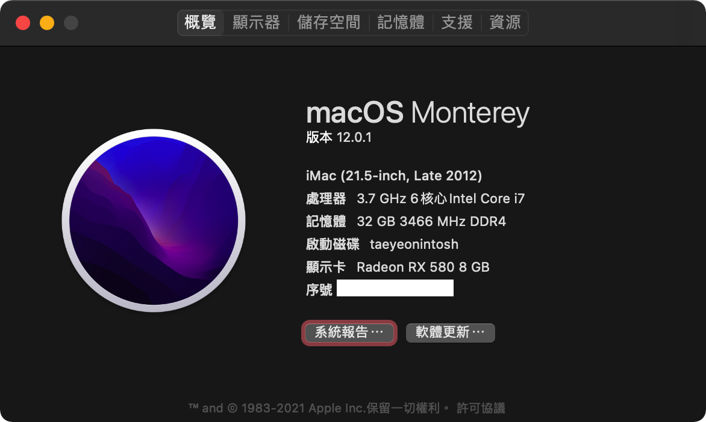

# Hackintosh with Opnecore (z370 i7-8700k rx580 8G 32gb ram)

  

## Version

- [macOS 12.0.1 Monterey](https://github.com/taeyeonssupdate/OpenCore-Z370-Gaming-7-i8-8700k-rx580-8G/tree/297a050c4453fc3ae947daa7021a6f98a66618d9)

- [OpenCore 0.7.5](https://github.com/taeyeonssupdate/OpenCore-Z370-Gaming-7-i8-8700k-rx580-8G/tree/297a050c4453fc3ae947daa7021a6f98a66618d9)

## setup

- [How to decide](https://dortania.github.io/OpenCore-Install-Guide/extras/smbios-support.html#how-to-decide)
- reboot select reset nvram
- boot from macOS

## source

- https://www.tonymacx86.com/threads/success-ga-z370-aorus-gaming-7-i7-8700k-rx5700xt-oc.299852/
- https://www.tonymacx86.com/threads/amd-radeon-performance-enhanced-ssdt.296555/

## Hardware

- Intel Core i7-8700K Coffee Lake
- Gigabyte Z370 AORUS Gaming 7
- Gigabyte Radeon RX 580 GAMING 8G
- 2x16GB HyperX FURY DDR4 3466Mhz HX434C17FB4/16
- SSD CRUCIAL MX500 CT500MX500SSD1
- PCI-e Broadcom BCM4360 WiFi ac + USB Bluetooth 4.2

## ACPI

- SSDT-AWAC.aml
- SSDT-EC-USBX.aml
- SSDT-PLUG.aml
- SSDT-RX580.aml
- SSDT-UIAC.aml

## Kexts

- AirportBrcmFixup.kext
- AppleALC.kext
- AtherosE2200Ethernet.kext
- DAGPM.kext
- IntelMausi.kext
- IntelSnowMausi.kext
- Lilu.kext
- SMCProcessor.kext
- SMCSuperIO.kext
- USBPorts.kext
- VirtualSMC.kext
- WhateverGreen.kext

## Drivers

- AudioDxe.efi
- OpenHfsPlus.efi
- OpenCanopy.efi
- OpenRuntime.efi

## Tools

- OpenShell.efi

## BIOS (Download from folder restore in BIOS)

- F15b (BIOS babckup)
- Profiles 0.7 (Profiles backup)

# ALAC1220 (顯示由上而下)

## 1

Linein k
Linein j
耳機 n 前板插入斷聲音 還是耳機

## 2

Linein o
Linein m
耳機 n
前板 內建

## 7

Linein j
Linein k
耳機 n 沒聲音
前板 內建

## 11

Linein j
Linein k
耳機 n 沒聲音
前板 內建

## 16

Linein k
Linein j
耳機 前板
內建 n

## 27

Linein j
Linein k
Linein 沒聲音
(n 沒聲音)
內建 前板

## 28

Linein j
Linein k
內建 n (需手動切換)
內建 前板 (需手動切換)

## 29

Linein j
Linein k
耳機 n 沒聲音
內建 前板
